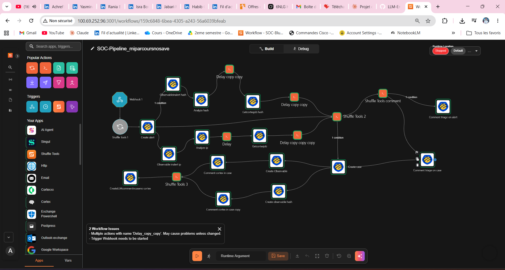
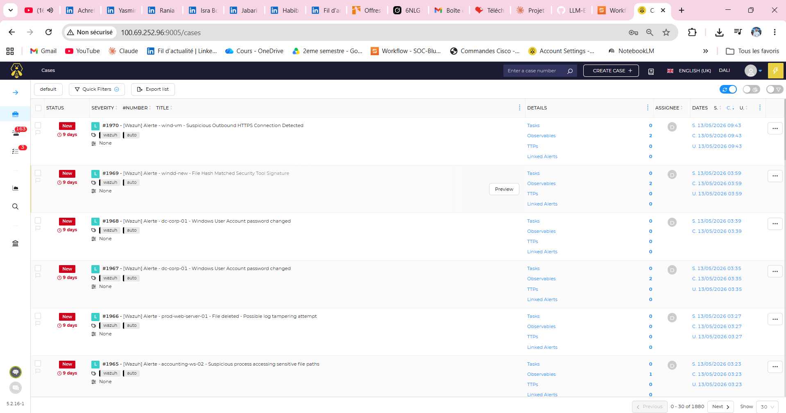
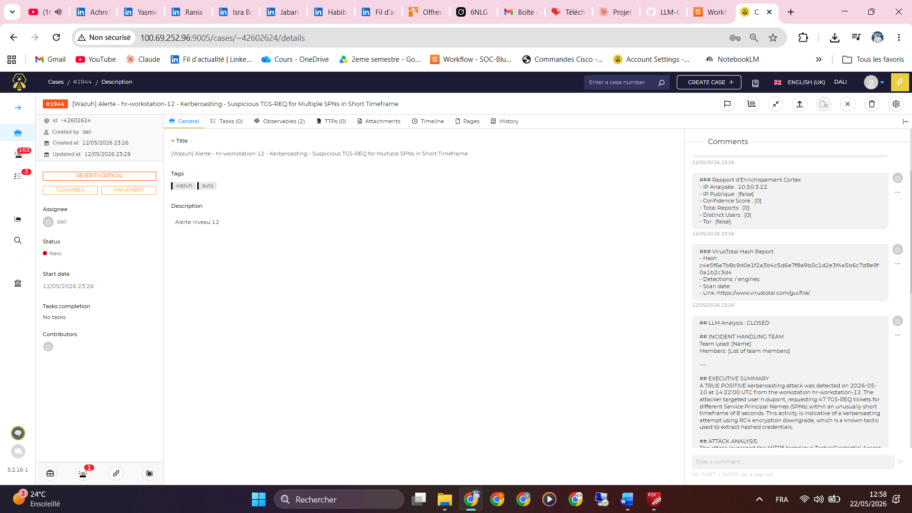

# 🛡️ SOC-LLM: Intelligent SOAR Pipeline with LLM-Assisted Triage & Reporting

> Integrating a Large Language Model into an open-source SOAR for intelligent alert triage and automated incident report generation.

---

## 📌 Overview

Modern SOC teams face an overwhelming volume of security alerts, most of which are redundant or low-priority. Manual triage is time-consuming, error-prone, and cognitively exhausting.

This project integrates a **local LLM** (Large Language Model) into an **open-source SOC stack** to assist analysts with:

- 🔍 **Intelligent triage** — classifying alerts as TRUE_POSITIVE or FALSE_POSITIVE
- 📄 **Automated incident reports** — generating structured, actionable reports
- 🔗 **IoC enrichment** — via AbuseIPDB and VirusTotal through Cortex
- 👤 **Human-in-the-Loop** — the analyst retains full control over decisions

---

## 🏗️ Architecture

```
Monitored Assets
      │
      ▼
  Wazuh (SIEM)          ← Log collection, detection rules, alert generation
      │
      ▼
 Shuffle (SOAR)         ← Orchestration, playbooks, workflow automation
      │
      ├──► Cortex        ← IoC enrichment (AbuseIPDB, VirusTotal)
      │
      ├──► LLM Module    ← Triage + Report generation (foundation-sec-8b-instruct via Ollama)
      │
      ▼
   TheHive              ← Incident management, analyst interface, case tracking
```

---

## 🧰 Tech Stack

| Component | Tool | Role |
|-----------|------|------|
| SIEM | [Wazuh](https://wazuh.com) | Event collection & alert generation |
| SOAR | [Shuffle](https://shuffler.io) | Workflow orchestration & automation |
| Incident Management | [TheHive](https://thehive-project.org) | Case management & analyst interface |
| IoC Enrichment | [Cortex](https://github.com/TheHive-Project/Cortex) | AbuseIPDB, VirusTotal analyzers |
| LLM Runtime | [Ollama](https://ollama.com) | Local LLM inference |
| LLM Model | [`foundation-sec-8b-instruct`](https://huggingface.co/cisco-ai/foundation-sec-8b) (Cisco) | Security-focused language model |

---

## ⚙️ Shuffle Workflow — Pipeline Description

### Trigger
- **Webhook** receives normalized alerts from Wazuh via Shuffle Tools 1

### Branch 1 — Hash Enrichment
```
ObservableInAlert_hash → Analyze_hash (VirusTotal) → Delay → GetCortexJob_hash
```

### Branch 2 — IP Enrichment
```
ObservableInAlert_ip → Analyze_ip (AbuseIPDB) → Delay → GetCortexJob_ip
```

### LLM Triage — Shuffle Tools 2
Receives enriched alert data and calls the local LLM to:
- Classify alert as `TRUE_POSITIVE` / `FALSE_POSITIVE`
- Output confidence score, severity, and reasoning

**Decision logic:**
```
FALSE_POSITIVE if: abuse_score < 10 AND vt_malicious == 0 AND rule_level < 7
TRUE_POSITIVE  if: abuse_score > 40 OR vt_malicious > 3 OR rule_level >= 10 OR is_tor == true
UNCERTAIN      → treated as TRUE_POSITIVE for safety
```

### Case Creation (if TRUE_POSITIVE)
```
Create_case (TheHive) → Create_Observable (IP + Hash) → Comment Cortex results
```

### LLM Report — Shuffle Tools 3
Generates a full structured incident report including:
- Executive Summary
- Attack Analysis (with MITRE ATT&CK mapping)
- Indicators of Compromise
- Impact Assessment
- Immediate & Long-term Remediation Actions
- Escalation recommendation

Report is posted as a comment directly inside the TheHive case.

---

## 🤖 LLM Integration

The LLM runs **locally** via Ollama, ensuring:
- ✅ Full data confidentiality (no external API calls)
- ✅ No dependency on cloud providers
- ✅ Reproducible outputs with `temperature: 0.1`

**Model used:** [`foundation-sec-8b-instruct`](https://huggingface.co/cisco-ai/foundation-sec-8b) — Cisco's open-source security-specialized LLM (8B parameters), selected for:
- Strict JSON output discipline (critical for SOAR integration)
- Deep knowledge of cybersecurity concepts, attack patterns, and MITRE ATT&CK
- Strong tool-interaction capabilities
- High response stability and reproducibility in automated pipelines

---

## 📋 LLM Output Format

### Triage (Shuffle Tools 2)
```json
{
  "verdict": "TRUE_POSITIVE",
  "confidence": 90,
  "severity": "HIGH",
  "reason": "Brute force from TOR exit node with high AbuseIPDB score",
  "enrichment_summary": "AbuseIPDB: score=95/100 | VirusTotal: malicious=12",
  "is_fp": false
}
```

### Incident Report (Shuffle Tools 3)
```
## EXECUTIVE SUMMARY
## ATTACK ANALYSIS
## INDICATORS OF COMPROMISE
## IMPACT ASSESSMENT
## IMMEDIATE ACTIONS (0-30 min)
## SHORT-TERM ACTIONS (24h)
## LONG-TERM RECOMMENDATIONS
## ESCALATION
```

---

## 🖼️ Screenshots

### Shuffle SOAR Workflow


### TheHive — Auto-Generated Cases (1880+ incidents)


### TheHive — Incident Detail with LLM Report


---

## 📁 Repository Structure

```
soc-llm-soar/
├── shuffle_workflow/
│   └── SOC-Pipeline.json          # Exportable Shuffle workflow
├── llm/
│   └── prompts/
│       ├── triage_prompt.txt      # Triage prompt template
│       └── report_prompt.txt      # Report generation prompt
├── docs/
│   └── architecture_diagram.png   # SOC architecture diagram
├── docker-compose.yml
├── .env.example
└── README.md
```

---

## 🔒 Security & Privacy

- The LLM runs **entirely on-premise** — no alert data leaves your infrastructure
- All LLM interactions are logged for auditability
- Human validation is required before any action is executed (Human-in-the-Loop)

---

## ⚠️ Known Issues

- Duplicate node names (`Delay_copy_copy`) in Shuffle — rename to avoid ambiguity
- Webhook trigger must be started manually after workflow import

---

## 📚 References

- [Wazuh Documentation](https://documentation.wazuh.com)
- [Shuffle SOAR](https://shuffler.io/docs)
- [TheHive Project](https://docs.thehive-project.org)
- [Cortex](https://github.com/TheHive-Project/Cortex)
- [Ollama](https://ollama.com/docs)
- [MITRE ATT&CK](https://attack.mitre.org)

---

## 👤 Author

**Your Name**  
Cybersecurity Engineering Student  
[LinkedIn](https://linkedin.com/in/yourprofile) · [GitHub](https://github.com/yourprofile)

---

## 📄 License

This project is licensed under the MIT License — see [LICENSE](LICENSE) for details.
